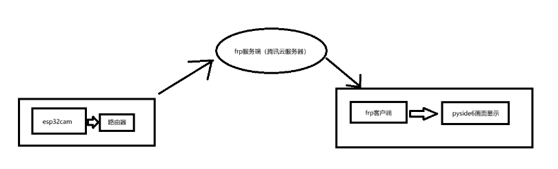
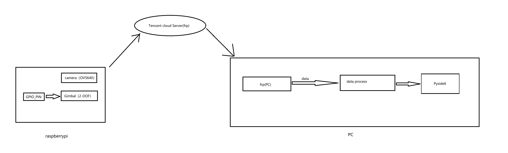
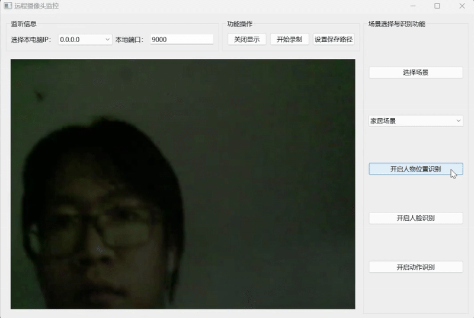

<div style="text-align: center;">

# Remote Video Surveillance System

</div>


<div style="text-align: center;">

**Author**: Veinsure Lee  
**Date**: 2025-04-20

</div>


---

## 1. Introduction

- **General Project Requirements**：
  1. Functionality：Real-time remote video surveillance; 24/7 recording of events within the camera’s field of view.  
  2. Recommended Devices：Embedded IoT gateway and smart actuator system. 
  3. Module Breakdown:
     - Camera Capture Module  
     - PTZ (Pan-Tilt-Zoom) Control Module
     - Network Transmission Module
     - Data Storage Module
     - Image Display Module
     - Others 
  4. Performance Indicators
     - Automatically adjust PTZ and save data every 10 minutes.
     - Trigger an alert in case of an anomaly.
     

- **Project Focus**：

This project focuses on receiving data from the ESP32 
and feeding it into a model for 
either **human recognition** or **license plate recognition**, 
depending on the scene.

Initially, data is sent via ESP32-CAM (UDP → TCP), 
with plans to switch to Raspberry Pi in future iterations.

**System Architecture:**

<div align="center">
  
</div>

<div align="center">
  
</div>

---

## 2. Framework Design

### 2.1 Scene Differentiation

#### 🏠 Home Scenario (Human Recognition)

- Person location detection using **YOLOv8n**
- Face recognition via `face_recognition` library
- Action recognition:
  - Data collection via web crawling (simple action classification)
  - Use **Mediapipe** to extract skeleton data
  - Train neural network for action classification

#### 🏙️ Public Scenario (License Plate Recognition)

- Detect candidate license plate areas via color block extraction
- Verify plate presence with trained model
- Binarize the detected plate region
- Segment characters:
  - Column-wise statistics  
  - Mean smoothing  
  - Peak-valley segmentation  
- Display recognized characters

---

### 2.2 Project Progress

You can use the following commands 
to download the project's required dependencies
```
pip install -r requirements.txt
```

Then run the following commands in the root directory:
```
python main.py
```
#### ✅ PySide6 GUI Display

- **Video Streaming Display**  
  <div align="center">
    
  </div>

- **Human Detection Enabled**  
  <div align="center">
    
  </div>  
  *Note: Dim lighting; displays "Unknown face, Unknown action"*

- **Face Recognition Enabled**  
  <div align="center">
    
  </div>  
  *Displays: test01, Unknown action*

- **Action Recognition Enabled**  
  <div align="center">
    
  </div>  
  *Displays: test01, fall down*  
  
  *(Note: Top-down view required for best results; side views cause misidentification)*

- **License Plate Recognition**

> **Note**: Implemented using `video_process.py` from `car_recognition` package. 
> Due to low camera resolution, recognition accuracy is limited.

**Before:**
<div align="center">
  
</div>

**After:**
<div align="center">
  
</div>

#### 🔜 Web page displaying camera feed

For details, please refer to the demo/pic/webpage.

(Basic video show by computer camera)

---


#### 🔜 mission in next step

Database:

Complete connections between database and detection, 
warning when danger appear.

WebPage:

Complete video show by camera, 
design detection usage to recognize.
