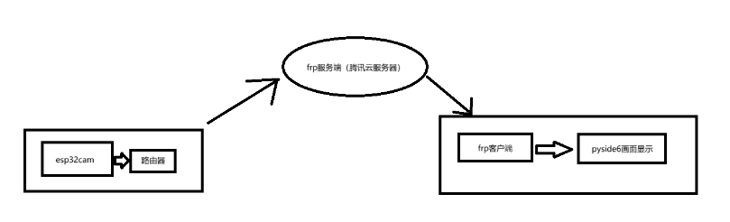
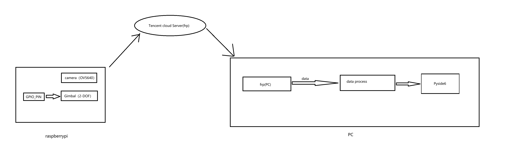

<!-- 居中标题（HTML 实现） -->
<div style="text-align: center;">

# 远程视频监控系统

</div>

<!-- 作者和日期（可选居中） -->
<div style="text-align: center;">

**Author**: Veinsure Lee  
**Date**: 2025-04-20

</div>

---

## 一、引言

- **总项目要求**：
  1. 实验实现的功能：实时远程摄像监控，24 小时记录摄像机范围内的各种事件。
  2. 建议设备：嵌入式物联网应用层网关及智能执行机构系统 
  3. 功能模块划分
     - 摄像采集模块
     - 云台控制模块
     - 数据网络互传模块
     - 数据存储模块
     - 图像显示模块
     - 其他
  4. 完成指标要求
     - 间隔 10 分钟调整一次云台取一次数据保存
     - 当发生异常时，系统提出报警
     - 
- **项目着眼点**：

基于总项目要求，本项目解决接收esp32端发送的数据，并接入模型，
根据场景的不同进行**人物识别**或**车牌识别**。


起步采用esp32cam进行数据的发送（UDP->TCP），后续框架将改为树莓派摄像头。


**框架图：**

<div align="center">
  
</div>

<div align="center">
  
</div>

---

## 二、框架设计

### 1. 场景区分

#### 🏠 家居场景（人物识别）

- 基于**YOLOv8n**训练的人物位置识别模型 
- 基于`face_recognition`设计的人脸识别
- 动作识别:
  - 爬虫爬取数据（简单分类）
  - **Mediapipe**处理图片获取骨架数据
  - 训练神经网络完成分类人物

#### 🏙️ 公共场景（车牌识别）

- 色块提取初步识别车牌位置
- 训练模型，对初步识别的车牌进行判断
- 对确定的车牌位置进行二值化
- 字符分割:
  - 计算列统计特性 
  - 均值卷积平滑 
  - 峰谷切割 
- 将识别结果显示


### 2. 项目进展

你可以用以下代码下载项目需要的依赖环境
```
pip install -r requirements.txt
```

然后在根目录下运行下面代码:
```
python main.py
```

#### ✅ pyside6显示

- **视频接收显示**：
<div align="center">
  
</div>

- **人类位置识别打开**：
<div align="center">
  
</div>
*此处颜色较暗，显示为Unknown face, Unknown action

- **人脸识别打开**：
<div align="center">
  
</div>
*显示test01, Unknown action

- **动作识别打开**：
<div align="center">
  
</div>
*显示test01, fall down

(由于数据集摄像数据有限，action detect需要俯视角度，平视或仰视角度误判率较高)

- **车牌识别**：
> **PS**: 此处为使用`car_recognition`包中的`video_process.py`实现，实际摄像头的摄像像素过低，无法正确识别


**Before:**
<div align="center">
  
</div>

**After:**
<div align="center">
  
</div>

#### 🔜 网页显示摄像头数据

未完待续

---


